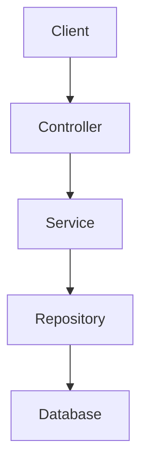

# 🚀 Guia de Publicação no GitHub

## 📋 Checklist Pré-Publicação

### ✅ Verificações Finais
- [x] Arquivo `.env` removido
- [x] Credenciais removidas
- [x] Testes passando
- [x] Código compilando
- [x] Documentação completa
- [x] LICENSE adicionada
- [ ] **IMPORTANTE**: Atualizar informações de autor no `package.json`
- [ ] **IMPORTANTE**: Adicionar sua URL do GitHub no README

## 🔧 Personalizações Necessárias

### 1. Editar package.json
```json
{
  "author": {
    "name": "SEU NOME AQUI",
    "email": "seu.email@exemplo.com",
    "url": "https://github.com/SEU-USUARIO"
  },
  "repository": {
    "type": "git",
    "url": "https://github.com/SEU-USUARIO/finance-api.git"
  }
}
```

### 2. Editar README.md
No final do arquivo, adicione:
```markdown
## 👨‍💻 Autor

**Seu Nome**

- GitHub: [@seu-usuario](https://github.com/seu-usuario)
- LinkedIn: [Seu Nome](https://linkedin.com/in/seu-perfil)
- Email: seu.email@exemplo.com
```

### 3. Editar src/server.ts
```typescript
/**
 * @author SEU NOME
 */
```

## 📤 Passos para Publicação

### Passo 1: Criar Repositório no GitHub

1. Acesse https://github.com/new
2. Nome: `finance-api` (ou outro de sua escolha)
3. Descrição: `API RESTful profissional com Clean Architecture e SOLID`
4. Público: ✅ **Marque como Public**
5. **NÃO** inicialize com README (já temos um)
6. Clique em "Create repository"

### Passo 2: Inicializar Git Local

```bash
# No diretório do projeto
cd "d:\Eu\Projetos GitHUB\Projeto 03"

# Inicializar repositório
git init

# Adicionar todos os arquivos
git add .

# Verificar o que será commitado
git status

# Criar primeiro commit
git commit -m "feat: initial commit - Finance API with Clean Architecture"
```

### Passo 3: Conectar ao GitHub

```bash
# Adicionar repositório remoto (SUBSTITUIR com seu URL)
git remote add origin https://github.com/SEU-USUARIO/finance-api.git

# Renomear branch para main (se necessário)
git branch -M main

# Push inicial
git push -u origin main
```

### Passo 4: Configurar GitHub

#### 4.1 About Section
1. Na página do repositório, clique em ⚙️ (engrenagem) ao lado de "About"
2. Description: `API RESTful profissional para gestão financeira com Clean Architecture, SOLID e TypeScript`
3. Website: (se tiver deploy)
4. Topics: `typescript`, `nodejs`, `clean-architecture`, `solid`, `rest-api`, `express`, `prisma`, `postgresql`
5. ✅ Marque "Packages" se usar

#### 4.2 README Preview
Verifique se o README está renderizando corretamente com:
- ✅ Badges
- ✅ Emojis
- ✅ Formatação
- ✅ Links funcionando

#### 4.3 Releases (Opcional)
```bash
# Criar tag v1.0.0
git tag -a v1.0.0 -m "Release v1.0.0 - Finance API"
git push origin v1.0.0
```

No GitHub:
1. Vá em "Releases"
2. "Create a new release"
3. Tag: v1.0.0
4. Title: "Finance API v1.0.0"
5. Description: Destacar features principais
6. Publish release

## 🎨 Melhorias Visuais (Opcional)

### Screenshots
1. Crie uma pasta `docs/images/`
2. Adicione screenshots da API funcionando
3. Adicione ao README:

```markdown
## 📸 Screenshots


```

### GIF Animado
Use ferramentas como:
- [Terminalizer](https://terminalizer.com/)
- [Asciinema](https://asciinema.org/)

### Diagrama de Arquitetura
Use [draw.io](https://draw.io) ou [Mermaid](https://mermaid.js.org/):

```markdown
## 🏗️ Arquitetura


``'

## 🔗 Divulgação

### LinkedIn
Crie um post anunciando o projeto:

```
🚀 Novo projeto no GitHub!

Finance API - API RESTful profissional desenvolvida com:

✅ Clean Architecture
✅ Princípios SOLID
✅ TypeScript
✅ 100% de cobertura de testes
✅ Docker ready

Este projeto demonstra boas práticas de:
- Arquitetura de Software
- Design Patterns
- Testes Automatizados
- Documentação Técnica

Confira no GitHub: [LINK]

#TypeScript #CleanArchitecture #SOLID #BackendDevelopment
```

### README do Perfil
Adicione ao seu README de perfil:

```markdown
### 🚀 Projetos em Destaque

- [Finance API](https://github.com/SEU-USUARIO/finance-api) - API RESTful com Clean Architecture e SOLID
```

## 📊 Métricas e Badges

### Adicionar Shields.io Badges Personalizados

```markdown


```

## 🎯 Checklist Final

Antes de compartilhar:

- [ ] Todas as personalizações feitas (autor, URLs, etc.)
- [ ] README revisado e sem erros de digitação
- [ ] Links funcionando
- [ ] Badges corretos
- [ ] Código testado
- [ ] .env não está no repositório
- [ ] Licença MIT verificada
- [ ] Screenshots adicionados (opcional)
- [ ] Releases criado (opcional)
- [ ] Post no LinkedIn preparado

## ⚠️ Avisos Importantes

### NÃO Fazer
- ❌ Commitar arquivo `.env`
- ❌ Incluir senhas ou tokens
- ❌ Push forçado (`git push -f`) sem necessidade
- ❌ Deletar `.gitignore`

### FAZER
- ✅ Sempre verificar `git status` antes de commit
- ✅ Mensagens de commit descritivas
- ✅ Manter documentação atualizada
- ✅ Responder issues e PRs
- ✅ Atualizar conforme feedback

## 🎓 Dicas para Destacar em Entrevistas

Ao mencionar este projeto:

1. **Arquitetura**: "Implementei Clean Architecture com separação clara de responsabilidades"

2. **SOLID**: "Apliquei todos os 5 princípios SOLID na prática, não apenas teoria"

3. **Testes**: "Alcancei 100% de cobertura nas camadas críticas usando Jest"

4. **TypeScript**: "Utilizei TypeScript em modo strict com generics e interfaces"

5. **Documentação**: "Criei documentação completa incluindo templates para contribuições"

## 📈 Próximos Passos

Após publicação:

1. **Semana 1**: Compartilhar no LinkedIn
2. **Semana 2**: Adicionar ao currículo
3. **Semana 3**: Considerar adicionar CI/CD
4. **Semana 4**: Fazer deploy em cloud (opcional)

## 🌟 Parabéns!

Você criou um projeto profissional e completo que demonstra:
- Excelência técnica
- Boas práticas
- Código limpo
- Documentação profissional

**Este é exatamente o tipo de projeto que recrutadores adoram ver!** 🚀

---

<div align="center">

**Boa sorte com suas aplicações!**

Se este guia ajudou, considere dar uma ⭐ no projeto!

</div>
